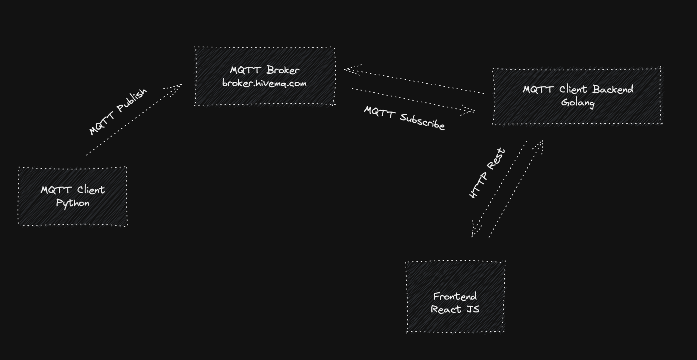

## IoT thermostat



#### Start console

#### install `paho-mqtt` broker

```bash
pip3 install paho-mqtt
```

#### run python

```bash
cd console
python3 publish.py
```

#### Start backend

```bash
cd backend
go run main.go

# copy file .env.example to .env
cp .env.example .env
```

#### Edit file .env with this variable

```
HOST=broker.hivemq.com
PORT=1883
CLIENT_ID=emqtest-random
```

#### Install and start frontend

```
cd frontend

# install
npm install

# start project
npm run start
```
